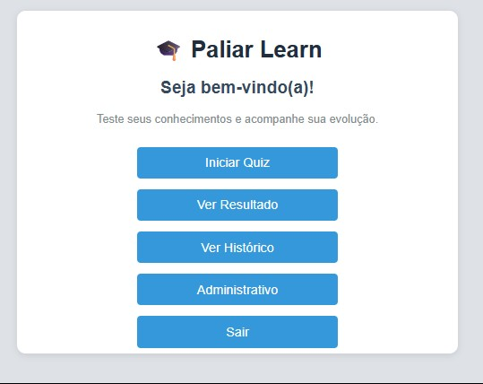
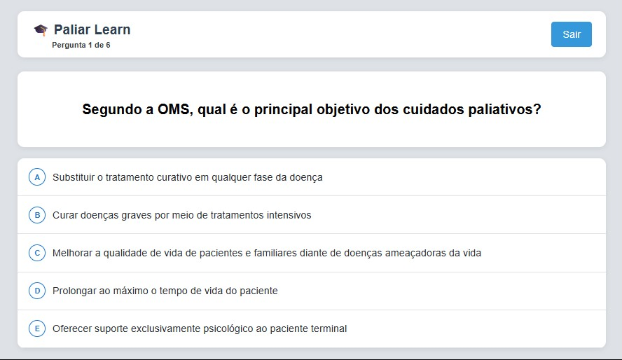
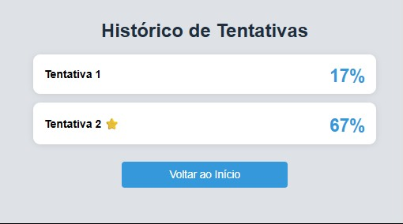
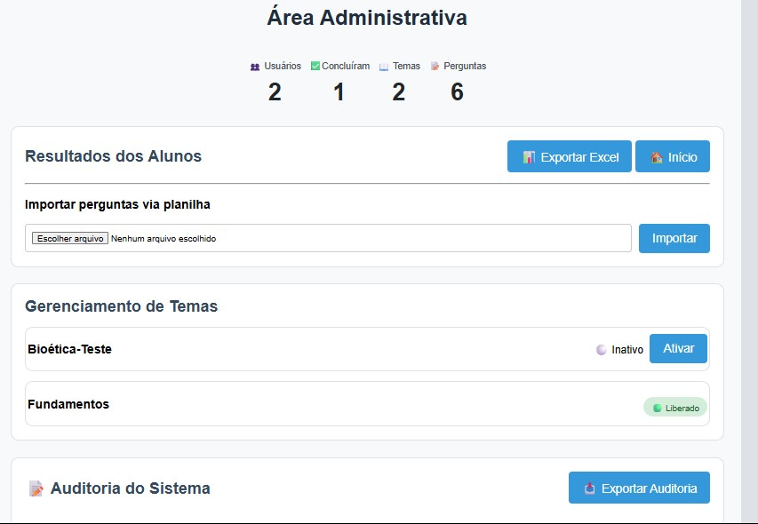

# Plataforma Quiz

Sistema Web desenvolvido para aplicação de avaliações ou como testes de conhecimento, permitindo que usuários realizem quizzes, acompanhem seus resultados e os administradores gerenciem perguntas, temas e desempenho dos participantes.

## Objetivo

Esse é um projeto pessoal que desenvolvi durante a minha graduação em Banco de Dados, como forma de ir além da sala de aula e entender como um sistema completo funciona na prática, do banco até a tela do usuário final.

Minha experiência em áreas administrativa, financeira e comercial contribuiu pra pensar e elaborar as regras de negócio do quiz, utilizando FastAPI, PostgreSQL, Git/GitHub, deploy no Railway e desenvolvendo habilidades em HTML,CSS e JavaScript.

## Tecnologias utilizadas

Durante o desenvolvimento da plataforma foram utilizadas as seguintes tecnologias:

### Backend
- Python
- FastAPI
- PostgreSQL
- SQLAlchemy

### Frontend
- HTML
- CSS
- JavaScript

### Versionamento e Deploy
- Git
- GitHub
- Railway

### Manipulação de Arquivos
- OpenPyXL

## Funcionalidades

A plataforma possui funcionalidades voltadas tanto para os participantes quanto para o administrador do sistema.

### Participante

- Login de usuário
- Realização de quizzes
- Retomada de tentativas não concluídas
- Correção automática das respostas
- Visualização do resultado ao final da tentativa
- Histórico das tentativas realizadas
- Controle de até 3 tentativas concluídas por usuário (tentativas não finalizadas não são contabilizadas)

### Administrativo

- Cadastro de temas
- Liberação de tema para aplicação
- Importação de perguntas por planilha Excel
- Exportação dos resultados em Excel
- Exportação dos registros de auditoria

## Arquitetura do projeto

O projeto foi dividido em duas partes principais:

### Backend

Responsável pelas regras de negócio, autenticação, APIs, comunicação com o banco de dados e processamento das informações.

### Frontend

Responsável pela interface do usuário, navegação entre as telas e comunicação com as APIs do backend.

### Banco de Dados

O PostgreSQL é utilizado para armazenar todas as informações da plataforma, incluindo usuários, temas, perguntas, alternativas, tentativas, respostas, resultados e registros de auditoria.

## Estrutura do projeto

```text
Quizz_edu/
│
├── backend/
│   ├── main.py
│   ├── models.py
│   ├── schemas.py
│   ├── database.py
│
├── assets/
│    └──images/
│
├── frontend/
│   ├── login.html
│   ├── home.html
│   ├── quiz.html
│   ├── resultado.html
│   ├── historico.html
│   ├── admin.html
│   ├── limite_tentativas.html
│   ├── style.css
│
├── requirements.txt
├── railway.json
├── .gitignore
└── README.md
```

## Regras de negócio

Durante o desenvolvimento foram definidas algumas regras para garantir o funcionamento da plataforma:

- Cada usuário pode realizar até 3 tentativas concluídas.
- Caso o usuário feche o quiz antes de finalizar, a tentativa permanece em aberto e pode ser retomada posteriormente.
- Apenas tentativas concluídas são contabilizadas no limite de tentativas.
- Apenas um tema por vez pode permanecer liberado para realização do quiz.
- O resultado é calculado automaticamente ao término da tentativa.
- Todas as liberações de temas e importações de perguntas ficam registradas na auditoria da aplicação.

## Principais desafios e aprendizados

Durante o desenvolvimento do projeto surgiram muitos desafios que contribuíram para meu aprendizado.

Entre eles, destaco:

- Implementação da lógica de controle de tentativas e cálculo automático dos resultados.
- Desenvolvimento e consumo de APIs utilizando FastAPI.
- Integração entre frontend, backend e banco de dados PostgreSQL.
- Organização das regras de negócio para garantir o funcionamento correto da plataforma.
- Correção de bugs encontrados durante os testes em ambiente local e em produção (Railway), incluindo o entendimento prático de que bancos de dados locais e de produção são ambientes independentes, exigindo replicação manual de dados entre eles.
- Aprimoramento da interface para funcionamento em desktop e dispositivos móveis.
- Utilização do Git e GitHub para versionamento do projeto durante todo o desenvolvimento.

## Melhorias futuras

Embora a plataforma esteja funcional, existem algumas melhorias que podem ser implementadas em versões futuras:

- Permitir até 3 tentativas por tema, em vez do limite por usuário.
- Login utilizando matrícula, tornando a plataforma mais adequada para instituições de ensino e empresas.
- Recuperação de senha.
- Possibilidade de integração via API com sistemas de matrícula já existentes na instituição, evitando cadastro manual de usuários.
- Cadastro e gerenciamento de usuários pela área administrativa.

## Como executar o projeto

### Pré-requisitos

Para executar o projeto é necessário ter instalado:

- Python 3.11 ou superior
- PostgreSQL
- Git

### 1. Clone o repositório

```bash
git clone https://github.com/luenmarbriani-sys/plataforma-quiz.git
```

### 2. Acesse a pasta do projeto

```bash
cd plataforma-quiz
```

### 3. Instale as dependências

```bash
pip install -r requirements.txt
```

### 4. Execute a aplicação

```bash
uvicorn backend.main:app --reload
```

### 5. Acesse a aplicação

Depois de iniciar o servidor, abra o navegador e acesse:

```text
http://127.0.0.1:8000
```
A tela de login será exibida automaticamente.

## Imagens da aplicação

### Tela de Login


### Tela Inicial



### Quiz



### Resultado


### Histórico



### Administrativo

